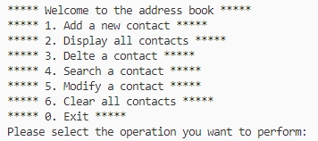
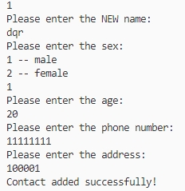

# black-horse-cpp : 黑马程序员中的cpp项目源码
## 项目一：通讯录管理系统
### 1.系统需求
* 添加联系人：信息包括(姓名、性别、年龄、联系电话、家庭住址)，最多1000人
* 显示联系人：显示所有联系人信息
* 删除联系人：按照姓名进行删除
* 查找联系人：按照姓名进行查找
* 修改联系人：按照姓名进行修改
* 清空联系人：清空通讯录中所有信息
* 退出通讯录
### 2.项目代码

* adderssBook文件夹下

### 3.功能实现
​	依据用户输入的操作进行相应的操作提示，下面给出不同操作的输出图示的两个例子

* 程序入口提示

  

* 添加联系人   

  
