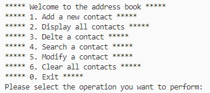
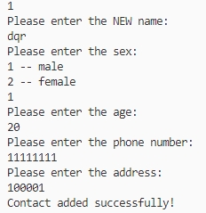
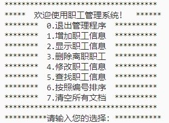
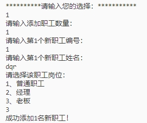
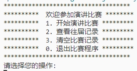
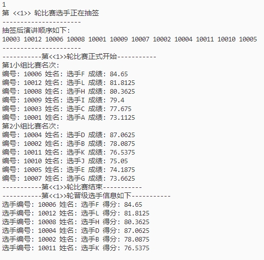
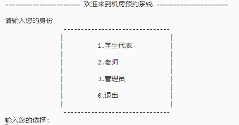
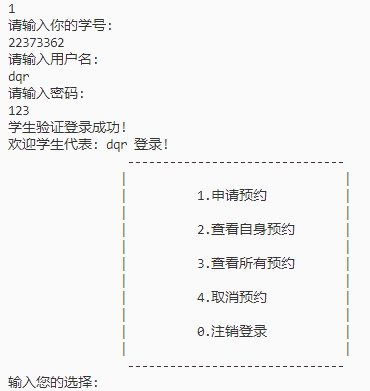

# black-horse-cpp : 黑马程序员中的cpp项目源码
## 项目一：通讯录管理系统(函数与结构体)

### 1.系统需求
* 添加联系人：信息包括(姓名、性别、年龄、联系电话、家庭住址)，最多1000人
* 显示联系人：显示所有联系人信息
* 删除联系人：按照姓名进行删除
* 查找联系人：按照姓名进行查找
* 修改联系人：按照姓名进行修改
* 清空联系人：清空通讯录中所有信息
* 退出通讯录
### 2.项目代码

* ``adderssBook``文件夹下

### 3.功能实现
​	依据用户输入的操作进行相应的操作提示，下面给出不同操作的输出图示的两个例子

* 程序入口提示

  

* 添加联系人   

  

## 项目二：职工管理系统(面向对象)

### 1.管理系统需求
* 职工管理用来管理公司内所有员工的信息
* 公司中职工分为三类
  * 普通员工
  * 经理
  * 老板
* 显示信息时，需要显示职工编号、职工姓名、职工岗位以及职责
  * 老板职责：管理公司所有事务
  * 经理职责：完成老板交给的任务，并下发任务给员工
  * 普通员工职责：完成经理交给的任务
* 需要实现的功能
  * 退出管理程序
  * 增加职工信息：职工编号、姓名、部门编号
  * 显示职工信息
  * 删除离职员工
  * 修改职工信息
  * 查找职工信息
  * 按照编号排序
  * 清空所有文档

### 2.项目代码

* ```workerManage```文件夹下，主要采用面向对象编写
  * ``.h``文件中进行了类定义和成员函数声明
  * ```.cpp```文件中进行具体的成员函数编写
  * 对于职工设计一个抽象类(类似于```java```中接口，抽象类不做任何实现，不写``.cpp``)，实现三个子类
    * 普通员工
    * 经理
    * 老板

### 3. 功能实现

* 程序入口提示

  

* 增加职工信息

  

## 项目三：通用数组(类模版案例)

### 1. 需求描述

* 实现一个通用的数组类，要求如下
  * 可以对内置数据类型以及自定义数据类型进行存储
  * 将数组中的数据存储到堆区
  * 构造函数中可以传入数组的容量
  * 提供对应的拷贝构造函数以及``operator=``运算符重载防止浅拷贝问题
  * 提供尾插法和尾删法对数组中的数据进行增加和删除
  * 通过下标方式访问数组
  * 可以获取数组中元素个数和数组的容量

### 2.代码实现

* 在``Array``文件夹下
* 类模版采用``.hpp``实现，写法按照``.h``为准
* 下标访问通过重载运算符operator[]实现

## 项目四：演讲比赛流程管理系统

### 1.需求描述
* 比赛方式：分组比赛，每组6人
* 第一轮分为两个小组，整体按照选手编号进行抽签后顺序演讲
* 十个评委分别给每名选手打分，去除最高分和最低分，求得平均分为本轮选手的成绩
* 小组演讲完后，淘汰组内排名最后的三个选手，前三名进入下一轮比赛
* 第二轮为决赛，前三名胜出
* 每轮比赛后需要显示晋级选手的信息
* 开始讲演比赛：完整比赛流程，要有用户提示
* 查看往届记录：查看之前比赛的前三名结果，每次比赛结果保存在文件中，用.csv后缀名保存
* 清空比赛记录：清空文件内容
* 退出比赛程序

### 2.代码实现
* 在```speechContest```文件夹下

### 3.功能实现
* 程序入口提示
  
  

* 进行比赛

  


## 项目五：机房预约系统

### 1.需求描述
* 学生代表：申请使用机房
* 教师：审核学生的预约申请，通过/不通过
* 管理员：给学生、教师创建账号
* 机房共有三间，1号(20人)，2号(50人)，3号(100人)
* 申请简介：申请的订单每周由管理员负责清空，学生可以预约未来一周内周一至周五、上午/下午
* 登陆界面可以选择三种身份并进行登录
* 学生/教师/管理员具体功能略

### 2.代码实现
* 在```computerRoomReservation```文件夹下
* 对于机房状态进行有限状态机设计

  * 0:取消的预约
  * 1:审核中
  * 2:已预约
  * -1:预约失败

### 3.功能实现
* 程序入口提示



* 学生代表提示窗口



